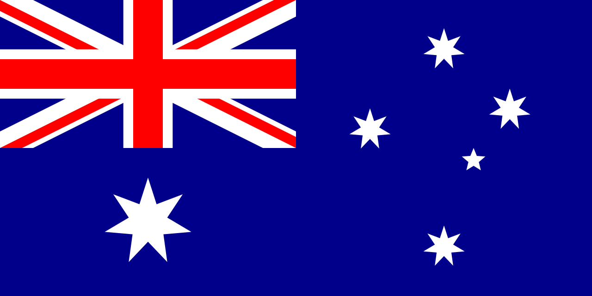

# Current flags

| code | flag                                               | language              |
|------|----------------------------------------------------|-----------------------|
| af   |        | Afrikaans             |
| akk  |        | Akkadian              |
| am   |        | Amharic               |
| grc  |        | Ancient Greek         |
| ar   |     | Arabic                |
| hy   |        | Armenian              |
| bm   |        | Bambara               |
| eu   |     | Basque                |
| be   |        | Belarusian            |
| bn   |        | Bengali               |
| bho  |        | Bhojpuri              |
| br   |    | Breton                |
| bg   |        | Bulgarian             |
| bxr  |     | Buryat                |
| yue  |        | Cantonese             |
| ca   |     | Catalan               |
| zh   |        | Chinese               |
| lzh  |   | Classical Chinese     |
| cop  |       | Coptic                |
| hr   |        | Croatian              |
| cs   |        | Czech                 |
| da   |        | Danish                |
| dar  |     | Dargwa                |
| nl   |        | Dutch                 |
| en   |        | English               |
| myv  |  | Erzya                 |
| et   |        | Estonian              |
| fo   |        | Faroese               |
| fi   |        | Finnish               |
| fr   |        | French                |
| gl   |     | Galician              |
| ka   |        | Georgian              |
| de   |        | German                |
| got  |       | Gothic                |
| el   |        | Greek                 |
| he   |        | Hebrew                |
| hi   |        | Hindi                 |
| qhe  |        | Hindi English         |
| hu   |        | Hungarian             |
| id   |        | Indonesian            |
| ga   |        | Irish                 |
| it   |        | Italian               |
| ja   |        | Japanese              |
| kn   |        | Kannada               |
| kk   |        | Kazakh                |
| kpv  |     | Komi Zyrian           |
| ko   |        | Korean                |
| kmr  |        | Kurmanji              |
| ky   |        | Kyrgyz                |
| la   |        | Latin                 |
| lv   |        | Latvian               |
| lt   |        | Lithuanian            |
| mt   |        | Maltese               |
| mr   |        | Marathi               |
| pcm  |        | Naija                 |
| sme  |      | North Sami            |
| no   |        | Norwegian             |
| cu   |    | Old Church Slavonic   |
| fro  |  | Old French            |
| fa   |        | Persian               |
| pbv  |        | Pnar                  |
| pl   |        | Polish                |
| pt   |        | Portuguese            |
| ro   |        | Romanian              |
| rm   |        | Romansh               |
| ru   |        | Russian               |
| sa   |        | Sanskrit              |
| sr   |        | Serbian               |
| shp  |        | Shipibo Konibo        |
| sd   |        | Sindhi                |
| sk   |        | Slovak                |
| sl   |        | Slovenian             |
| so   |        | Somali                |
| ckb  |    | Sorani                |
| es   |        | Spanish               |
| sv   |        | Swedish               |
| swl  |        | Swedish Sign Language |
| tl   |        | Tagalog               |
| ta   |        | Tamil                 |
| te   |        | Telugu                |
| th   |        | Thai                  |
| tr   |        | Turkish               |
| uk   |        | Ukrainian             |
| hsb  |       | Upper Sorbian         |
| ur   |        | Urdu                  |
| ug   |        | Uyghur                |
| vi   |        | Vietnamese            |
| wbp  |        | Warlpiri              |
| cy   |    | Welsh                 |
| wo   |        | Wolof                 |
| yo   |        | Yoruba                |
